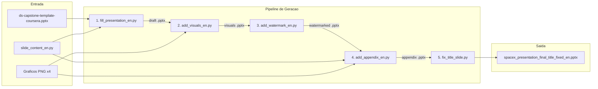
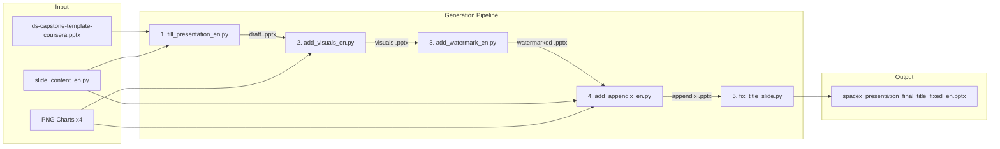

# SpaceX Falcon 9 - Gerador de Apresentacao PowerPoint

Conjunto de scripts Python que geram programaticamente uma apresentacao PowerPoint sobre o historico de lancamentos do SpaceX Falcon 9 e Falcon Heavy, utilizando dados coletados da Wikipedia. Desenvolvido como projeto final do IBM Data Science Professional Certificate (Coursera).

[](https://python.org)
[](https://python-pptx.readthedocs.io/)
[](LICENSE)

[English](#english)

---

## Indice

- [Visao Geral](#visao-geral)
- [Arquitetura](#arquitetura)
- [Estrutura do Projeto](#estrutura-do-projeto)
- [Como Usar](#como-usar)
- [Saidas](#saidas)
- [Autor](#autor)

## Visao Geral

Este repositorio contem 5 scripts Python que, executados em sequencia, constroem uma apresentacao `.pptx` completa sobre o Falcon 9:

1. **`fill_presentation_en.py`** - Preenche o template Coursera com slides de conteudo (titulo, sumario executivo, estatisticas, conclusao, referencias)
2. **`add_visuals_en.py`** - Insere graficos PNG (configuracoes de foguetes, locais de lancamento, resultados, pousos de boosters) nos slides correspondentes
3. **`add_watermark_en.py`** - Adiciona marca d'agua com o nome do autor em todos os slides
4. **`add_appendix_en.py`** - Cria slides de apendice com graficos adicionais e legendas
5. **`fix_title_slide.py`** - Adiciona nome do autor e data no slide de titulo

Os dados factuais vem do arquivo `spacex_data_en.md`, coletado da Wikipedia (abril 2025), e o conteudo dos slides esta definido em `slide_content_en.py`.

## Arquitetura



## Estrutura do Projeto

```
SpaceX-Data-Science-collect/
├── fill_presentation_en.py          # Passo 1: preenche template com conteudo
├── add_visuals_en.py                # Passo 2: insere graficos nos slides
├── add_watermark_en.py              # Passo 3: adiciona marca d'agua
├── add_appendix_en.py               # Passo 4: cria slides de apendice
├── fix_title_slide.py               # Passo 5: corrige slide de titulo
├── slide_content_en.py              # Definicoes de conteudo dos slides
├── spacex_data_en.md                # Dados factuais coletados da Wikipedia
├── ds-capstone-template-coursera.pptx  # Template PowerPoint do Coursera
├── rocket_configurations_chart_en.png  # Grafico: configuracoes de foguetes
├── launch_sites_chart_en.png        # Grafico: locais de lancamento
├── launch_outcomes_chart_en.png     # Grafico: resultados de lancamentos
├── booster_landings_chart_en.png    # Grafico: pousos de boosters
├── spacex_presentation_final_title_fixed_en.pptx  # Apresentacao final gerada
├── spacex_presentation_final_title_fixed_en.pdf   # PDF exportado
├── requirements.txt
├── LICENSE
└── README.md
```

## Como Usar

```bash
# Clonar o repositorio
git clone https://github.com/galafis/SpaceX-Data-Science-collect.git
cd SpaceX-Data-Science-collect

# Instalar dependencia
pip install -r requirements.txt

# Executar os scripts em sequencia
python fill_presentation_en.py
python add_visuals_en.py
python add_watermark_en.py
python add_appendix_en.py
python fix_title_slide.py
```

Cada script le o `.pptx` gerado pelo anterior e produz um novo arquivo intermediario. O resultado final e `spacex_presentation_final_title_fixed_en.pptx`.

## Saidas

A apresentacao final ja esta inclusa no repositorio:

- **`spacex_presentation_final_title_fixed_en.pptx`** - Apresentacao PowerPoint completa (12 slides + apendice)
- **`spacex_presentation_final_title_fixed_en.pdf`** - Versao PDF exportada

## Autor

**Gabriel Demetrios Lafis**
- GitHub: [@galafis](https://github.com/galafis)
- LinkedIn: [Gabriel Demetrios Lafis](https://linkedin.com/in/gabriel-demetrios-lafis)

## Licenca

Este projeto esta licenciado sob a Licenca MIT - veja o arquivo [LICENSE](LICENSE) para detalhes.

---

## English

# SpaceX Falcon 9 - PowerPoint Presentation Generator

A set of Python scripts that programmatically generate a PowerPoint presentation about SpaceX Falcon 9 and Falcon Heavy launch history, using data collected from Wikipedia. Developed as the final project for the IBM Data Science Professional Certificate (Coursera).

### Overview

This repository contains 5 Python scripts that, run in sequence, build a complete `.pptx` presentation about Falcon 9:

1. **`fill_presentation_en.py`** - Fills the Coursera template with content slides (title, executive summary, statistics, conclusion, references)
2. **`add_visuals_en.py`** - Inserts PNG charts (rocket configurations, launch sites, outcomes, booster landings) into corresponding slides
3. **`add_watermark_en.py`** - Adds a watermark with the author's name on all slides
4. **`add_appendix_en.py`** - Creates appendix slides with additional charts and captions
5. **`fix_title_slide.py`** - Adds author name and date to the title slide

Factual data comes from `spacex_data_en.md`, collected from Wikipedia (April 2025), and slide content is defined in `slide_content_en.py`.

### Architecture



### Project Structure

```
SpaceX-Data-Science-collect/
├── fill_presentation_en.py          # Step 1: fill template with content
├── add_visuals_en.py                # Step 2: insert charts into slides
├── add_watermark_en.py              # Step 3: add watermark
├── add_appendix_en.py               # Step 4: create appendix slides
├── fix_title_slide.py               # Step 5: fix title slide
├── slide_content_en.py              # Slide content definitions
├── spacex_data_en.md                # Factual data collected from Wikipedia
├── ds-capstone-template-coursera.pptx  # Coursera PowerPoint template
├── rocket_configurations_chart_en.png  # Chart: rocket configurations
├── launch_sites_chart_en.png        # Chart: launch sites
├── launch_outcomes_chart_en.png     # Chart: launch outcomes
├── booster_landings_chart_en.png    # Chart: booster landings
├── spacex_presentation_final_title_fixed_en.pptx  # Final generated presentation
├── spacex_presentation_final_title_fixed_en.pdf   # Exported PDF
├── requirements.txt
├── LICENSE
└── README.md
```

### Usage

```bash
# Clone the repository
git clone https://github.com/galafis/SpaceX-Data-Science-collect.git
cd SpaceX-Data-Science-collect

# Install dependency
pip install -r requirements.txt

# Run scripts in sequence
python fill_presentation_en.py
python add_visuals_en.py
python add_watermark_en.py
python add_appendix_en.py
python fix_title_slide.py
```

Each script reads the `.pptx` generated by the previous one and produces a new intermediate file. The final result is `spacex_presentation_final_title_fixed_en.pptx`.

### Outputs

The final presentation is already included in the repository:

- **`spacex_presentation_final_title_fixed_en.pptx`** - Complete PowerPoint presentation (12 slides + appendix)
- **`spacex_presentation_final_title_fixed_en.pdf`** - Exported PDF version

### License

This project is licensed under the MIT License - see the [LICENSE](LICENSE) file for details.
